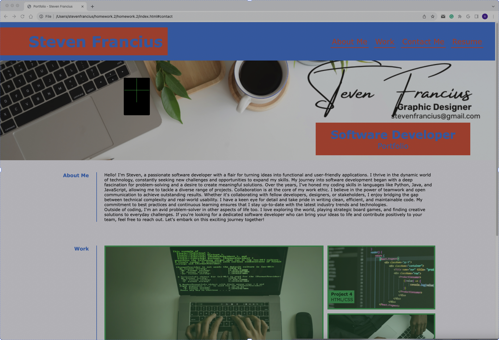

# Portfolio

# My Portfolio

A simple portfolio website to showcase my work and skills.



## Table of Contents

- [Introduction](#introduction)
- [Features](#features)
- [Demo](#demo)
- [Getting Started](#getting-started)
  - [Prerequisites](#prerequisites)
  - [Installation](#installation)
- [Usage](#usage)
- [Contributing](#contributing)
- [License](#license)

## Introduction

My Portfolio is a web application designed to display my professional work, skills, and experience. It provides an easy way for potential employers or collaborators to view my projects and get in touch with me.

## Features

- Display my name, photo, and contact information.
- Sections to showcase my work, skills, and experience.
- Smooth navigation between different sections.
- Responsive layout for various devices.

## Demo

You can check out the live demo of my portfolio at [https://guadeloupe33.github.io/Professional-Portfolio/].

## Getting Started

Follow the instructions below to set up this portfolio on your local machine.

### Prerequisites

Before you begin, ensure you have met the following requirements:

- Web browser (e.g., Chrome, Firefox)
- Code editor (e.g., Visual Studio Code)

### Installation

1. Clone this repository to your local machine:

   ```shell
   git clone https://github.com/Guadeloupe33/Professional-Portfolio.git
   Navigate to the project directory:

shell
Copy code
cd my-portfolio
Open the index.html file in your web browser to view the portfolio locally.

Usage
To personalize and populate this portfolio with your own information and projects, follow these steps:

Open the index.html file in a code editor.

Update the content in the HTML file to include your name, photo, contact information, skills, and experience.

Replace the sample project images and descriptions with your own projects.

Customize the CSS in the style.css file to match your preferred design.

Save the changes and reload the index.html file in your web browser to see your updated portfolio.

Feel free to customize the portfolio to your liking and add more sections as needed.

Contributing
If you'd like to contribute to this project, please follow these steps:

Fork the project on GitHub.

Create a new branch with a descriptive name:

shell
Copy code
git checkout -b feature/your-feature-name
Make your changes and commit them:

shell
Copy code
git commit -m 'Add your feature'
Push your changes to your forked repository:

shell
Copy code
git push origin feature/your-feature-name
Create a pull request on the original repository.

License
This project is licensed under the MIT License. See the LICENSE file for details.


